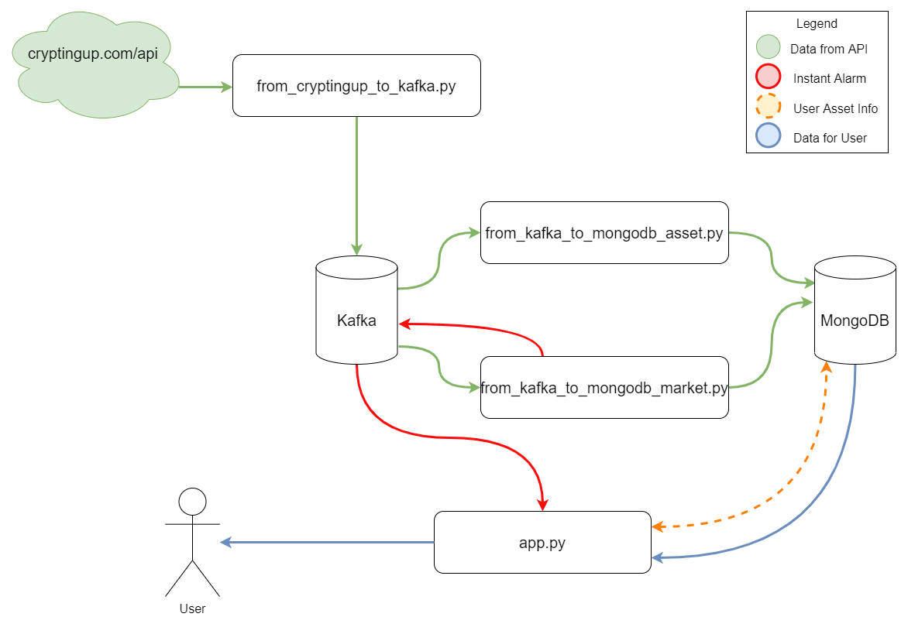

# bigDataProject

## Proje tasarımı

### Dosyalar ve içerikleri

#### app.py: Önyüz için SocketIO/Flask uygulaması
#### design.drawio: Yukarıdaki tasarım çiziminin https://app.diagrams.net/ adresinden alınan kaydı 
#### design.png: Yukarıdaki tasarım çizimi 
#### docker-compose.yml: Docker üzerinde birden fazla container çalıştırabilmek için kullanılan docker-compose dosyası. Kafka ve MongoDB için gerekli container tanımlarını içerir.
#### from_cryptingup_to_kafka.py: Cryptingup Api'lerinden alınan bilgilerin kafka'ya gönderilmesi ve Kafka'da tanımlı değil ise topicleri oluşturan Python dosyası 
#### from_kafka_to_mongodb_asset.py: Kafka'dan anlık değişen asset bilgilerini MongoDB'ye kayıt eden Python dosyası
#### from_kafka_to_mongodb_market.py: Kafka'dan anlık değişen market bilgilerini MongoDB'ye kayıt eden Python dosyası
#### graphs.py: Grafikler için kodlarımı yazdığım Python dosyası
#### index.html:
#### my_library.py: Spark, Kafka ve MongoDB ile entegrasyonlar için kodlarımı yazdığım Python dosyası

## Projeyi çalıştırma adımları

### 1. Kafka'yı ve MongoDB'yi başlatabilmek için aşağıdaki komutu girin:  
>docker-compose up

Not: Makinanızda docker ve docker-compose yüklü olmalıdır.

### 2. Cryptingup Api'lerinden Kafka'ya mesajların gönderilmesi için aşağıdaki Python dosyasını çalıştırın:
> cryptingup_to_kafka.py

### 3. Kafka'dan varlık değerlerini MongoDB'ye almak için aşağıdaki Python dosyasını çalıştırın:
> from_kafka_to_mongodb_asset.py

### 4. Kafka'dan varlıkların marketlerdeki değerlerini MongoDB'ye almak için aşağıdaki Python dosyasını çalıştırın:
> from_kafka_to_mongodb_market.py

### 5. SocketIO/Flask uygulaması için Python dosyasını çalıştırın:
> app.py

### 6. Önyüze ulaşmak için tarayıcıdan aşağıdaki adrese giriş yapın:
> http://127.0.0.1:5000
